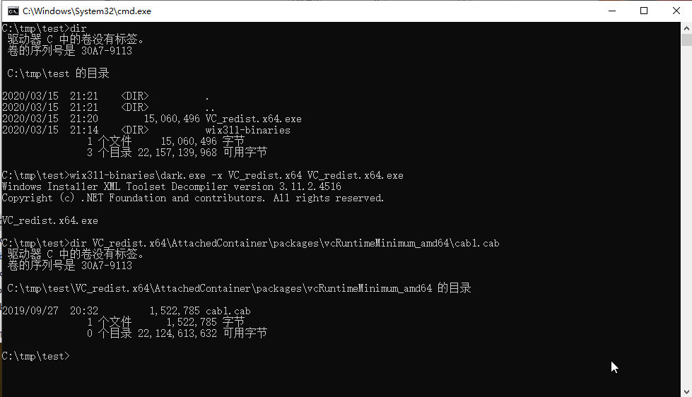

## Portable MySQL

### Windows

MySQL 5.7 的较高版本，zip 格式下载的文件中不包含 VC 运行库（`msvcr120.dll`、`msvcp120.dll`），而这两个 DLL 在 5.7 较低版本的 zip 文件中是有的，从低版本 zip 文件的 bin 目录复制到解压缩后的 bin 目录下即可。

MySQL 8.0 zip 格式下载的文件中同样不包含 VC 运行库（这次是 `vcruntime140_1.dll`），如果不准备安装 Microsoft Visual C++ Redistributable（2019？），参考 https://gist.github.com/donno/34aeb93dbaefa13a0d6a41953a17c024 的做法如下：

- 下载 Microsoft Visual C++ Redistributable 2019，64 位的下载地址 https://aka.ms/vs/16/release/VC_redist.x64.exe ；
- 下载 WiX Toolset （ https://github.com/wixtoolset/wix3 ）;
- 使用 dark.exe 解压 VC_redist.x64.exe ，在 vcRuntimeMinimum_amd64 子目录下找到 cab1.cab，解压后可以找到需要的 vcruntime140_1.dll ;

解压过程可以参考如下截图：

